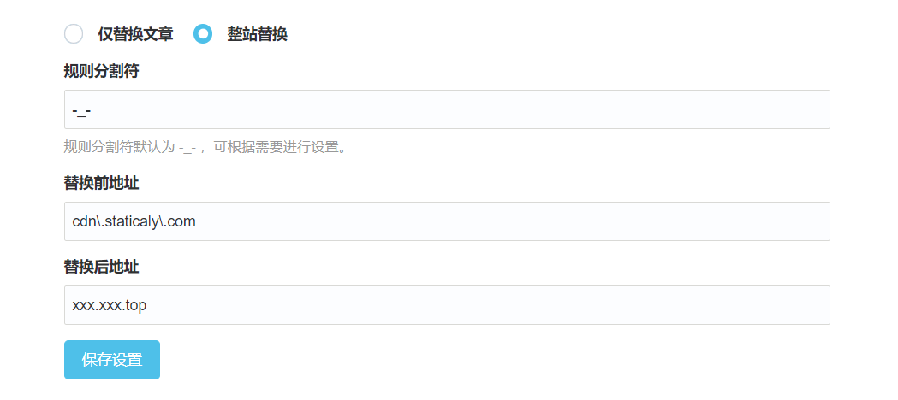

# ReplaceURL

A plugin for replacing links to various text (usually some files or pictures) in typecho

## Install

Download this plugin, rename it to **ReplaceURL** and copy it to the Typecho plugins directory,Usually, it is located at

```
/path...to...your...typecho/usr/plugins/
```

## Usage

You can refer to [this project](https://github.com/Quarkay/Typecho-SimpleCDN). The usage of this project is exactly the same as that of that project. The difference is that this project can not only replace the links of the markdown articles before rendering, but also replace the links of the whole site

## Screenshot


